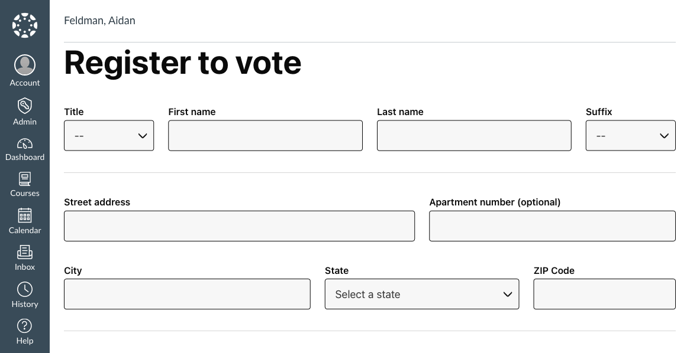

# Blackboard and Canvas LMS

VoteAmerica+ works with Blackboard LMS and Canvas LMS to make voter registration easy and convenient.
If you are an LMS administrator you can add the VoteAmerica+ Register to Vote tool to your instance.

The VoteAmerica+ LMS plugin is made available through as an [LTI 1.3](https://www.imsglobal.org/spec/lti/v1p3/) tool, and thus should be compatible with all [certified platforms](https://site.imsglobal.org/certifications?refinementList%5Blti_implementation_type%5D%5B0%5D=Type%3A%20Platform%20%28Consumer%29&refinementList%5Bstandards_lvlx%5D%5B0%5D=Learning%20Tools%20Interoperability%C2%AE%20%28LTI%29&refinementList%5Bstandards_lvlx%5D%5B1%5D=Learning%20Tools%20Interoperability%C2%AE%20%28LTI%29%20%3E%20Learning%20Tools%20Interoperability%20%28LTI%29%20v1.3). In other words, the plugin should work with most LMS platforms.

If your students are below the age of 18, please direct them to [Future Voter](https://www.futurevoter.com/)!

If you run into any issues or are looking to integrate with an LMS that isn't listed below, [get in touch](https://about.voteamerica.com/contact).

## Enable Blackboard Integration

For use with [Blackboard Learn](https://www.blackboard.com/teaching-learning/learning-management/blackboard-learn), follow the instructions to [Add an LTI 1.3/Advantage Tool](https://help.blackboard.com/Learn/Administrator/SaaS/Integrations/Learning_Tools_Interoperability#addlti13).

1. Use the following as the Client ID: `cc80f05c-b028-4cae-9720-166246248167`
1. Set `Tool Status` to `Approved`
1. Under `Institution Policies`, leave `Name` and `Email Addressed` checked; you can uncheck / set the rest to `No`.

## Enable Canvas Integration

To add to [Canvas](https://www.instructure.com/canvas):

1. [Configure an LTI key](https://community.canvaslms.com/t5/Admin-Guide/How-do-I-configure-an-LTI-key-for-an-account/ta-p/140)
   1. For `Key Name`, enter `VoteAmerica`
   1. Under `Method`, select `Enter URL`
   1. Fill `JSON URL` with `https://lti.voteamerica.com/register/canvas`
   1. Click `Save`
1. Under the `Details` column, copy the Client ID and [send it to the VoteAmerica+ team](https://about.voteamerica.com/contact).
1. Modify the placement
   1. Edit the `VoteAmerica` LTI key
   1. Under `Placements`, change to `User Navigation`
   1. Click `Save`
1. Enable the key
   1. Turn `State` to `ON`
   1. Under `Details`, copy the Client ID
1. [Add the External App](https://community.canvaslms.com/t5/Admin-Guide/How-do-I-configure-an-external-app-for-an-account-using-a-client/ta-p/202)
1. In the sidebar, click `Account`, then `Register to vote`. You should see the tool appear and look something like the following:

   
